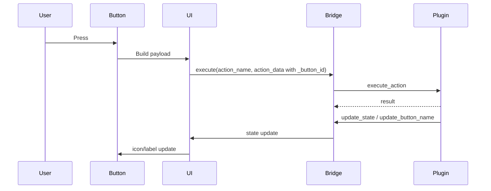

# Comprehensive Guide to Creating Plugins and Customizing Buttons and States

This guide collects everything you need to create a plugin compatible with the current system, from the basics to advanced icon and state customization, with a complete overview of the ready-made settings layouts.

---

## 1) Basics (Start Here)

### 1.1 Plugin Folder Structure

Inside the `Plugins` folder, each plugin has its own folder, typically containing a main Python file and any helper/config files as needed.

**Important Note on External Libraries (`requirements.txt`)**
If your plugin depends on external libraries (like `requests` or `psutil`), you should place a `requirements.txt` file inside your plugin's folder. The system will automatically detect and install these dependencies before the plugin runs.

**Important Note on Folders for Distribution**
When sharing or installing plugins, you must place:
- The plugin folder in: `%appdata%/Ignite Panel/plugins`
- The plugin's icons in: `%appdata%/Ignite Panel/icons`

### 1.2 Plugin and Actions Definition

The core definition lives in the ADDON_INFO dictionary inside the plugin file, and includes the plugin metadata and its actions:

```python
ADDON_INFO = {
    "name": "Sample Plugin",
    "description": "Short description",
    "version": "1.0.0",
    "author": "Your Name",
    "plugin_icon": "sample_icon.svg",
    "actions": [
        {
            "name": "Action One",
            "type": "Sample",
            "icon": "action_icon.svg",  # DO NOT use paths like "icons/action_icon.svg"
            "description": "What this action does",
            "settings": [
                {"type": "text_input", "name": "text_value", "label": "Text"}
            ]
        }
    ]
}
```

Core fields:

- name: Plugin name.
- description: Short description.
- plugin_icon: Plugin icon in the plugins list.
- host_app_name: Optional host application name (if the plugin depends on an external app).
- host_app_exe: Optional executable name for the host app (used for detection or guidance).
- actions: List of available actions.
- requires_config: If True, the action requires configuration before execution.

### 1.3 Create the Plugin Class

The class contains the action execution logic and the Bridge wiring for communication with the app.

```python
class SamplePlugin:
    def __init__(self):
        self.bridge = None

    def set_bridge(self, bridge):
        self.bridge = bridge

    def execute_action(self, action_name, action_data):
        try:
            if action_name == "Action One":
                value = (action_data or {}).get("text_value", "")
                return {"success": True, "value": value}
        except Exception as e:
            # Always catch exceptions so the action doesn't fail silently
            return {"success": False, "message": str(e)}
        return {"success": False}

plugin_instance = SamplePlugin()
```

### 1.4 Where Are Values Stored?

Each Setting has a name, and its value is stored in action_data. When executing an action, you can read it like this:

```python
value = (action_data or {}).get("setting_name")
```

### 1.5 Lifecycle and Connection Hooks (Optional)

Use lifecycle hooks when the plugin needs startup/shutdown work (connect, start polling, cleanup). If the plugin needs these hooks to be called automatically, add a marker file named requires_lifecycle.txt in the plugin folder.

```python
class SamplePlugin:
    def on_start(self):
        return {"success": True}

    def on_stop(self):
        return {"success": True}
```

You can also expose connection checks used by the system before executing an action:

```python
class SamplePlugin:
    def check_connection(self):
        return True

    def get_connection_error_message(self):
        return "Connection failed"
```

### 1.6 Runtime Lifecycle and Instance Model

The plugin instance is created once for the whole application, not per button. All buttons that use the same action share the same plugin instance, so treat the plugin as a long‑lived service.

Runtime order on app start:

1) Scan plugin folders.
2) Read ADDON_INFO.
3) Import the plugin module and create plugin_instance.
4) Call set_bridge once.
5) If requires_lifecycle.txt exists, call on_start once.
6) If any requirements.txt exist, they are merged and installed before plugins run.

Action execution flow:

1) A button is pressed.
2) The system collects the saved settings for that specific button.
3) action_data is created and _button_id is injected as a unique button id.
4) execute_action is called.

Important rules:

- execute_action represents a button press event, not a button itself.
- action_data is per button and changes only when that button’s settings change.
- _button_id is how you distinguish between multiple buttons using the same action.
- state stored on the plugin object is shared by all buttons unless you separate it manually.
- ADDON_INFO is read once at load time and must be treated as static at runtime.

---

## 2) Action Settings (Static + Dynamic)

### 2.1 Static Settings Inside ADDON_INFO

```python
"settings": [
    {"type": "dropdown_text", "name": "mode", "label": "Mode", "options": [
        {"label": "Toggle", "value": "toggle"},
        {"label": "Enable", "value": "enable"},
    ]}
]
```

### 2.2 Dynamic Settings From Code

If the options depend on the device/network, use prepare_settings_data:

```python
def prepare_settings_data(self, action_name, saved_values):
    if action_name != "Dynamic Action":
        return None
    options = [{"label": "A", "value": "a"}]
    return {"settings": [
        {"type": "select", "name": "item", "label": "Item", "options": options}
    ], "values": saved_values or {}}
```

### 2.3 When prepare_settings_data Runs

- It runs when opening a button’s settings UI.
- It runs again when any setting that has on_change: prepare_settings changes.
- It does not execute the action and should only build settings UI data.
- action_data is not passed here; saved_values is the stored settings for that button.

If you need live UI or custom interactions, use create_settings_widget. It runs inside the app UI process, so do not block the UI thread. Return a widget or None.

### 2.4 Important Additional Settings Properties

- required: Makes the field mandatory.
- default or value: Initial default value.
- placeholder: Placeholder text inside the field.
- options: Options list for select, dropdown_text, and dropdown_icons.
- on_change: Rebuild settings when a value changes (for example, selecting a scene to refresh sources).
- visible_if: Conditional display based on another field using equals, truthy, or any/all.
- action: For button, can be set to prepare_settings to refresh settings.
- payload: Extra data passed with a button when action is used.
- store: Store extra data from dropdown options inside meta.*.
- variant / expand / height: Visual properties for button.
- force_text_only: Show text only in the list without icons.
- pick_mode: Path selection mode in file_picker (file or folder).
- filter: File filter string for file_picker.
- button_text: Custom small button text inside file_picker.
- hide_icon: Hide the icon for a card_group card.
- item_height: Custom item height for dropdowns.
- icon_size: Icon size for dropdown icons.
- view_icon_size: Icon size used inside the dropdown list.
- icon_url: Optional remote icon source for dropdown options.

---

## 3) Action Icon (Static or Toggle)

### 3.1 Single Static Icon

```python
{"name": "Action", "type": "Sample", "icon": "my_icon.svg"}
```

### 3.2 Toggle Icon (Two States)

```python
{
    "name": "Toggle Action",
    "type": "Sample",
    "state_key": "sample.toggle",
    "icon": "off.svg",
    "toggle_icon": "on.svg"
}
```

**CRITICAL: Icon File Names vs. Paths**
Always write *only the filename* for icons (e.g., `"play.svg"`), and **NEVER** write a folder path (like `"icons/play.svg"`). The Ignite Panel system automatically locates the icon whether you're running the IDE version or the compiled EXE version. Just make sure the icon is placed in `%appdata%/Ignite Panel/icons`.

To update the state during execution:

```python
if self.bridge:
    self.bridge.update_state("sample.toggle", True)
```

### 3.3 State Key Templates

When you need a unique state key per button, define a state_key_template in the action and build the final key from settings or a button identifier.

```python
{
    "name": "Action",
    "type": "Sample",
    "state_key_template": "sample.state.{button_id}",
    "icon": "off.svg",
    "toggle_icon": "on.svg"
}
```

Use _button_id from action_data to build the final key, and keep a per‑button map if you need multiple button states at once:

```python
def execute_action(self, action_name, action_data):
    button_id = (action_data or {}).get("_button_id")
    if not button_id:
        return {"success": False}
    key = f"sample.state.{button_id}"
    
    # Example: Read current state, toggle it, and update
    current_state = self._my_states.get(button_id, False)
    new_state = not current_state
    self._my_states[button_id] = new_state
    
    if self.bridge:
        self.bridge.update_state(key, new_state)
    return {"success": True}
```

---

## 4) More Than Two Icons by State

When you need 3 states or more, use icon_state_key instead of toggle_icon, then send the icon path from code.

General example of an action that changes the icon by state:

```python
{
    "name": "Repeat",
    "type": "Music",
    "icon": "repeat_off.svg",
    "icon_state_key": "music.repeat.icon",
    "icon_state_key_scope": "global"
}
```

In execution:

```python
icon_map = {
    "off": "repeat_off.svg",
    "context": "repeat_context.svg",
    "track": "repeat_track.svg",
}
icon_path = icon_map.get(mode, "repeat_off.svg")
if self.bridge:
    self.bridge.update_state("music.repeat.icon", icon_path)
```

### 4.1 icon_state_key_scope and update_state Behavior

- icon_state_key_scope: global updates every button that uses the same icon_state_key.
- icon_state_key_scope: button updates only the button bound to that key.
- update_state only changes the UI state and icon; it does not execute the action or press the button.

Use state_key for boolean/toggle state and icon_state_key for multi‑icon state. Keep the keys consistent with the action definition.

---

## 5) Changing the Icon Based on Action Settings

This mechanism updates the icon automatically based on the user's selection in settings.

### 5.1 From a Dropdown That Shows Icons

```python
{
    "type": "dropdown_icons",
    "name": "game_name",
    "label": "Game",
    "options": [
        {"label": "Game A", "value": "a", "icon": "a.png"},
        {"label": "Game B", "value": "b", "icon": "b.png"},
        {"label": "Dynamic URL", "value": "c", "icon_url": "https://example.com/icon.png"},
        {"label": "Running App", "value": "d", "icon_path": "C:\\Program Files\\App\\app.exe"}
    ],
    "use_selected_icon_as_button_icon": True
}
```

*Note on Dynamic Icons:* You are not limited to local static images. You can pass:
- `icon`: The name of a local file in the icons folder.
- `icon_url`: A direct web link to an image.
- `icon_path`: An absolute path to an executable (`.exe`). The system will automatically extract and display the `.exe`'s embedded icon.

With a general action definition:

```python
{
    "name": "Select & Launch",
    "type": "Sample",
    "icon": "action_icon.svg",
    "icon_state_key": "sample.launch.icon",
    "icon_state_key_scope": "button"
}
```

### 5.2 From an exe File Picker

```python
{
    "type": "file_picker",
    "name": "application_path",
    "placeholder": "Application path...",
    "use_picked_exe_icon_as_button_icon": True
}
```

---

## 6) Auto-Updating Button State (Polling)

This approach updates the state without user interaction.

Principle:

1) Start a background thread.
2) Check the state periodically.
3) When it changes, send update_state via the bridge.

```python
def _poll_loop(self):
    while self._running:
        current_state = self._read_state_somehow()
        if current_state != self._last_state:
            self._last_state = current_state
            if self.bridge:
                self.bridge.update_state("sample.state", current_state)
        time.sleep(1.5)
```

Important condition: the action must have a state_key that matches the key you send.

### 6.1 Threading Rules

- Long or blocking work must run in a background thread.
- Do not touch UI widgets from a background thread.
- Use bridge.update_state and bridge.update_button_name to send UI updates.

---

## 7) Ready-Made Settings Layouts (Names + Short Description)

The following names are the available types for action settings, and each type has a predefined layout:

### 7.1 Basic Elements

- text_input: Simple text field with placeholder and custom width.
- text: Static text display field.
- checkbox: Simple checkbox with True/False.
- toggle_switch: A nicer toggle button instead of checkbox.
- toggle: Same as toggle_switch and used inside card_group cards.
- file_picker: File/path picker with a browse button.
- message: Text card to show a note or explanation.
- button: Button that triggers a specific event from within settings.
- text_row: Row containing multiple text fields via fields, each with name and width.

### 7.2 Dropdowns

- dropdown_text: Text-only dropdown.
- dropdown_icons: Dropdown with icons for each option.
- dropdown: Same behavior as dropdown_text.
- select: Same behavior as dropdown_text.

### 7.3 Ready Cards (Full Templates)

- dropdown_card: Ready card with a dropdown, title, and icon.
- launch_app_card: Full card to select and launch an app with app icon support.
- close_app_card: Full card to select an app to close.
- brightness_card: Brightness settings card with increase/decrease buttons.
- hotkey_card: Styled hotkey settings card.

### 7.4 Grouping Elements in One Card

- card_group / group / card: Holds multiple settings inside one card.

### 7.5 Fully Custom Settings UI

If you need a non-standard UI, you can ignore the ready-made templates and build a custom UI in create_settings_widget.
This is suitable for settings that require manual UI construction or instant list updates.

---

## 8) Full General Template

This is a complete general example based on the current plugin structure:

```python
ADDON_INFO = {
    "name": "Sample Control",
    "description": "Control actions and show state",
    "version": "1.0.0",
    "author": "Dev",
    "plugin_icon": "media.svg",
    "actions": [
        {
            "name": "Play/Pause",
            "type": "Sample",
            "state_key": "sample.playing",
            "icon": "play_pause.svg",
            "toggle_icon": "play_pause.svg",
            "description": "Toggle playback",
        },
        {
            "name": "Repeat Mode",
            "type": "Sample",
            "icon": "repeat_off.svg",
            "icon_state_key": "sample.repeat.icon",
            "icon_state_key_scope": "global",
            "description": "Cycle repeat mode",
        },
        {
            "name": "Launch App",
            "type": "Sample",
            "icon": "launch-app.svg",
            "icon_state_key": "sample.launch.icon",
            "icon_state_key_scope": "button",
            "settings": [
                {"type": "file_picker", "name": "application_path", "placeholder": "Path...", "use_picked_exe_icon_as_button_icon": True},
                {"type": "toggle_switch", "name": "toggle_open_close", "label": "Toggle open/close"}
            ]
        }
    ]
}

class SamplePlugin:
    def __init__(self):
        self.bridge = None
        self._last_state = None
        self._running = True
        self._poll_thread = threading.Thread(target=self._poll_loop, daemon=True)
        self._poll_thread.start()

    def set_bridge(self, bridge):
        self.bridge = bridge

    def _poll_loop(self):
        while self._running:
            current = self._read_state()
            if current != self._last_state:
                self._last_state = current
                if self.bridge:
                self.bridge.update_state("sample.playing", current)
            time.sleep(1.5)

    def execute_action(self, action_name, action_data):
        if action_name == "Play/Pause":
            new_state = self._toggle_playback()
            if self.bridge:
                self.bridge.update_state("sample.playing", new_state)
            return {"success": True, "state": new_state}

        if action_name == "Repeat Mode":
            mode = self._cycle_repeat()
            icon_map = {"off": "repeat_off.svg", "context": "repeat.svg", "track": "repeat_track.svg"}
            icon_path = icon_map.get(mode, "repeat_off.svg")
            if self.bridge:
                self.bridge.update_state("sample.repeat.icon", icon_path)
            return {"success": True}

        if action_name == "Launch App":
            app_path = (action_data or {}).get("application_path")
            ok = self._launch(app_path)
            return {"success": ok}

        return {"success": False}

plugin_instance = SamplePlugin()
```

---

## 9) Runtime Flow and Sequence Diagram

Action flow summary:

1) Button press creates action_data and injects _button_id.
2) Bridge dispatches execute_action.
3) Plugin performs the work.
4) Plugin sends update_state or update_button_name.
5) UI updates the button(s).



Settings flow summary:

1) Open button settings.
2) prepare_settings_data builds settings.
3) on_change triggers prepare_settings again when needed.

---

## 10) Real‑World Example (Shared Service + Multiple Buttons)

This example shows multiple buttons controlling one long‑lived service, per‑button state keys, polling, and dynamic settings.

```python
import threading
import time

ADDON_INFO = {
    "name": "Music Service",
    "description": "Control playback across multiple buttons",
    "version": "1.0.0",
    "author": "Dev",
    "plugin_icon": "music.svg",
    "actions": [
        {
            "name": "Play/Pause",
            "type": "Music",
            "state_key": "music.playing",
            "icon": "play.svg",
            "toggle_icon": "pause.svg",
            "description": "Toggle playback"
        },
        {
            "name": "Select Device",
            "type": "Music",
            "state_key_template": "music.device.{button_id}",
            "icon": "device.svg",
            "toggle_icon": "device.svg",
            "settings": [
                {
                    "type": "dropdown_text",
                    "name": "device_id",
                    "label": "Device",
                    "options": [],
                    "on_change": "prepare_settings"
                }
            ]
        }
    ]
}

class MusicPlugin:
    def __init__(self):
        self.bridge = None
        self._running = True
        self._last_playing = None
        self._button_devices = {}
        self._poll_thread = threading.Thread(target=self._poll_loop, daemon=True)
        self._poll_thread.start()

    def set_bridge(self, bridge):
        self.bridge = bridge

    def prepare_settings_data(self, action_name, saved_values):
        if str(action_name).lower() != "select device":
            return None
        devices = self._fetch_devices()
        settings = [{
            "type": "dropdown_text",
            "name": "device_id",
            "label": "Device",
            "options": devices,
            "on_change": "prepare_settings"
        }]
        return {"settings": settings, "values": saved_values or {}}

    def execute_action(self, action_name, action_data):
        name = str(action_name or "").lower()
        if name == "play/pause":
            new_state = self._toggle_playback()
            if self.bridge:
                self.bridge.update_state("music.playing", new_state)
            return {"success": True}

        if name == "select device":
            button_id = (action_data or {}).get("_button_id")
            device_id = (action_data or {}).get("device_id")
            if not button_id or not device_id:
                return {"success": False, "message": "Missing button_id or device_id"}
            self._button_devices[button_id] = device_id
            key = f"music.device.{button_id}"
            if self.bridge:
                self.bridge.update_state(key, True)
                self.bridge.update_button_name(f"Device: {device_id}", button_id)
            return {"success": True}

        return {"success": False}

    def _poll_loop(self):
        while self._running:
            playing = self._get_play_state()
            if playing != self._last_playing:
                self._last_playing = playing
                if self.bridge:
                    self.bridge.update_state("music.playing", playing)
            time.sleep(1.0)

    def on_stop(self):
        self._running = False
        return {"success": True}

    def _fetch_devices(self):
        return [{"label": "Device A", "value": "A"}, {"label": "Device B", "value": "B"}]

    def _toggle_playback(self):
        return True

    def _get_play_state(self):
        return False

plugin_instance = MusicPlugin()
```

---

## 11) Important Practical Notes

- Any icon/state updates depend on matching state_key and icon_state_key between the action and the code.
- Values in action_data are the primary input for action execution.
- If you need a state-based icon (more than two states), use icon_state_key instead of toggle_icon.
- Button name updates are available via bridge.update_button_name when needed.
- If a plugin has external dependencies, a requirements.txt in its folder can be used for auto-install.
- Advanced icon updates can also be applied directly through a dedicated icon manager when available.

---

## 12) Publishing Your Plugin to the Store

Once your plugin is ready, you can publish it to the official Ignite Panel Store so others can use it. The process is fully automated via GitHub.

### 12.1 Prepare Your Repository
You must host your plugin on GitHub. You can create a repository for a single plugin, or a "Mono Repo" (one repository containing multiple plugin folders).

Inside your repository  you **must** create a `manifest.json` file. 

Example `manifest.json`:
```json
{
  "name": "Plugin Name",
  "version": "1.0.0",
  "description": "Short description of what your plugin does.",
  "author": "Your Name",
  "icon": "https://github.com/Username/RepoName/blob/main/PluginFolder/icon_name.svg" 
}
```

*Important Manifest Rules:*
- **name**: Must match the plugin's name.
- **version**: Every time you want to release an update, you **must** increment this version in `manifest.json` to match the version in your Python file's `ADDON_INFO`.
- **icon**: Must be a direct raw URL or GitHub blob URL pointing to the plugin's icon file in your repository. This icon will be displayed in the Store.

### 12.2 Submit to the Developer Portal
Once your code is pushed to GitHub and the `manifest.json` is ready:

1. Go to the Developer Portal: [https://ignitepanel.pages.dev/developer](https://ignitepanel.pages.dev/developer)
2. Log in using your Google Account (currently the only supported login method).
3. Paste the link to your GitHub repository into the provided field And if it a mono repo u need to past the folder link not the repo link.
4. Click the **"Add"**  button.

Your plugin (or plugins, if it's a mono repo) will be scanned, validated using the `manifest.json` files, and automatically added to the Store for all users to download!
And the system will automatically update the plugin if theres a new version in the repository every 1 hour.