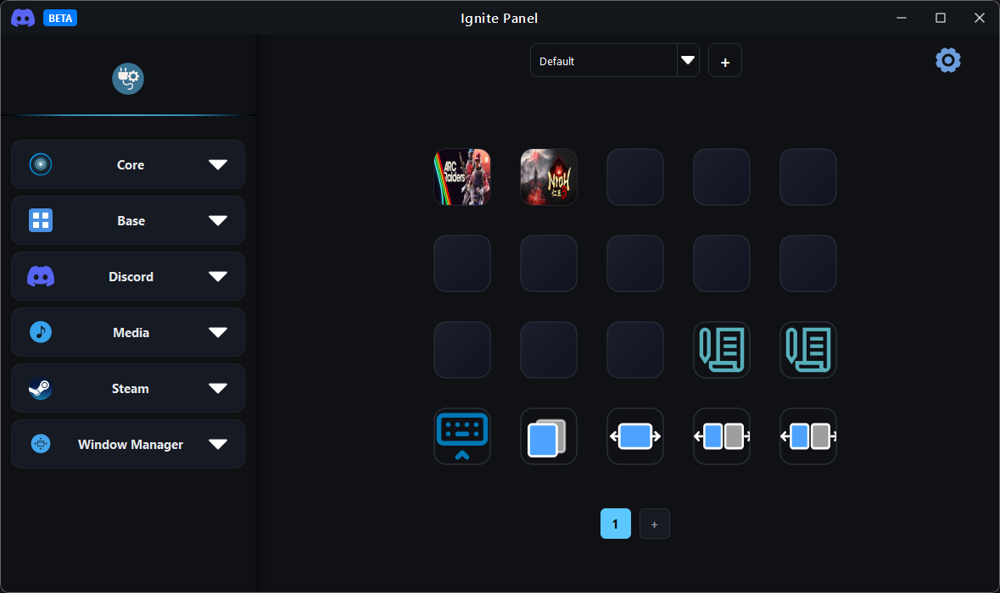
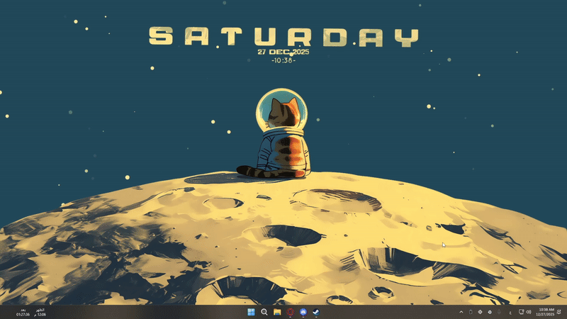

# Ignite Panel

  

**Ignite Panel** is a powerful customizable **control panel and automation system** designed to help you automate actions, streamline your workflow, and control applications with ease.

It provides an intuitive interface for creating, editing, and triggering actions using your **keyboard**, **mouse**, or both — and even from your Android phone.

Ignite Panel acts as a full **software alternative to Stream Deck and Macro Deck**, allowing you to create programmable buttons and execute complex actions instantly.

---

## 🔥 Features

### 🧩 Plugins

Ignite Panel includes **13 official plugins** covering system control, media, streaming tools, and application management.

When the program is first launched, **6 plugins are available by default**.  
The remaining plugins can be downloaded directly from inside the application.

---

### 🧑‍💻 Create Your Own Plugins

Ignite Panel is designed to be **fully extensible**. Developers can create their own plugins to add new actions and integrations.

If you want to build a plugin for Ignite Panel, follow the step-by-step guide below:

➡️ **[Plugin Creation Guide](PLUGIN_CREATION_GUIDE.md)**

The guide explains how to:
- Set up the plugin structure
- Create custom actions
- Integrate them with Ignite Panel
- Build and test your plugin

---

### 🔀 Multi Action

Combine multiple actions into a single button and execute them sequentially and instantly.  
This feature works with any action from any plugin.

---

### 🎛️ Easy Action Setup

The program includes a clean and simple interface allowing you to:

- Add new actions
- Configure action settings
- Assign a trigger (keyboard, mouse, or both)
- Organize your shortcuts in a structured panel

---

### 🎛️ Multi-State Buttons

Each button supports **three interaction states**:

- Click
- Double Click
- Long Press

Each state can execute a completely different action.

---

### ⚡ Quick Board Overlay

**Quick Board** is an overlay window that displays your buttons directly on the screen.

- Appears above any application or game
- Toggle using a single shortcut
- Execute actions using the mouse
- No need to remember many hotkeys

Perfect for gaming, streaming, or productivity workflows.

---

### 📱 Phone Control

Ignite Panel includes an Android companion app allowing you to control your PC remotely.

You can:
- View your buttons
- Trigger actions wirelessly
- Control your setup remotely

---

## 🌍 Language Support

Ignite Panel currently supports **25 languages**.

---

## 📸 Screenshots

### Main Interface

### Quick Board Overlay

---

## 🚀 Getting Started

1. Download the latest release  
https://github.com/iishkas/Ignite-Panel/releases/latest/download/IgnitePanel.exe

2. Launch Ignite Panel  
3. Start creating buttons and automating your workflow

---

## 🤝 Contributing

Contributions are welcome! Whether it's improving plugins, creating new ones, reporting bugs, or suggesting features.
